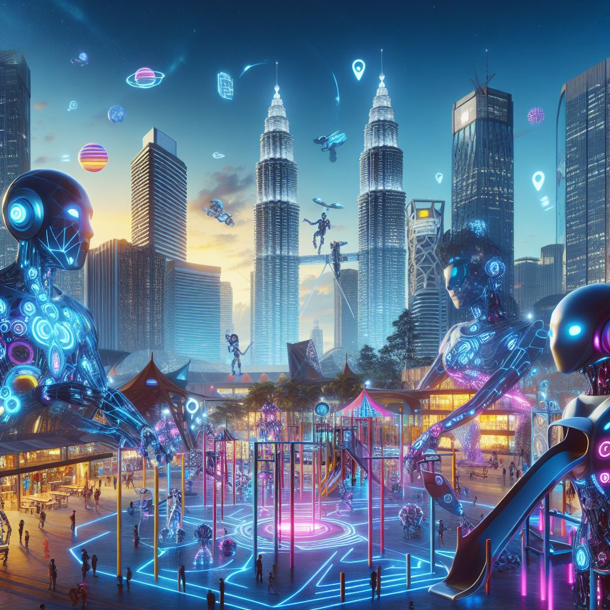

# Discover the Power of Generative AI

Generative-AI-Playground is an innovative platform dedicated to exploring and experimenting with a variety of generative models and techniques. It offers users the opportunity to engage with cutting-edge technologies like ChatGPT, Bing.AI, and Gemini in a practical and educational setting. The platform serves as a valuable resource for learning and honing skills in generative AI, providing tutorials, tips, and a supportive community for users to explore and create.

At Generative-AI-Playground, users can dive into the world of generative AI to unleash their creativity. Whether you're interested in generating art, crafting text, or simply exploring the possibilities of these powerful models, the platform offers a welcoming space to learn and experiment. With its user-friendly interface and comprehensive resources, Generative-AI-Playground is a valuable tool for anyone looking to explore the exciting field of generative AI.

Generative AI is a rapidly evolving field that's revolutionizing the way we interact with technology. Focusing on ChatGPT, Gemini, and Copilot, here's an overview of their contributions to the power of Generative AI:

1. **ChatGPT**: Developed by OpenAI, ChatGPT is a conversational agent that can engage in dialogue, answer questions, and generate text-based content. It's built on the GPT (Generative Pretrained Transformer) model, which uses deep learning to produce human-like text. ChatGPT has been integrated with various multimodal models, allowing it to process and generate not just text but also images and sounds, making it a versatile tool for content creation¹.

2. **Gemini**: Google's entry into the generative AI chatbot space, Gemini, is designed to integrate with Google's ecosystem. It aims to provide users with a seamless experience across various Google services. Gemini is expected to leverage Google's vast data and advanced AI algorithms to deliver accurate and contextually relevant responses².

**Copilot**: Microsoft's Copilot is an AI-powered assistant that's embedded in Microsoft's suite of products, including Bing, Windows, and Office. It utilizes GPT-4, a model developed by OpenAI, to assist users in tasks ranging from writing emails to coding. Copilot is known for its conversational tone and the ability to provide suggestions and solutions across different scenarios. It stands out for its user-friendly approach and integration with Microsoft's search engine, offering cited responses for verification².

Each of these AI tools has unique features and capabilities, but they all share the common goal of enhancing productivity and creativity. They represent the cutting edge of Generative AI, providing users with powerful tools to generate content, automate tasks, and access information in innovative ways.

## Exploring Generative AI Ecosystems

Generative AI may seem simple to use, but behind the scenes, it's quite complex. Let's explore what makes these systems work:

🔵 **User Interface**: This is where you interact with AI, like through chatbots or mobile apps.

🟢 **Coordination Layer**: This helps different services work together quickly and accurately to answer your questions.

🔴 **Data Management**: To respond quickly, AI needs a complex system to store and retrieve data efficiently.

🔷 **Connectivity & Expansion**: APIs connect different AI models, making it easy to add new features to apps.

🛠️ **Development Tools**: Developers use these tools to create, test, and improve AI models.

🌐 **Technical Backbone**: AI needs powerful hardware and cloud services to run smoothly.

## Materials
| Module  | Topic |
|:--------:|---------|
| 1 | [Understanding AI in Academic Contexts](https://github.com/drshahizan/ai-tools/blob/main/materials/hero/mod1.md) |
| 2 | [Generative AI](https://github.com/drshahizan/ai-tools/blob/main/materials/hero/mod2.md) |
| 3 | [AI Tools for Academic Writing](https://github.com/drshahizan/ai-tools/blob/main/materials/hero/mod3.md) |

## Contribution 🛠️
Please create an [Issue](https://github.com/drshahizan/ai-tools/issues) for any improvements, suggestions or errors in the content.

You can also contact me using [Linkedin](https://www.linkedin.com/in/drshahizan/) for any other queries or feedback.

