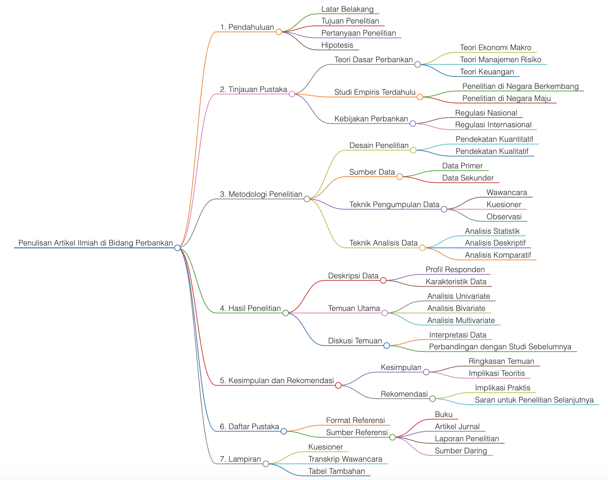

<a href="https://github.com/drshahizan/Generative-AI-Playground/stargazers"></a>
<a href="https://github.com/drshahizan/Generative-AI-Playground/network/members"></a>
<a href="https://github.com/drshahizan/Generative-AI-Playground/pulls"></a>
<a href="https://github.com/drshahizan/Generative-AI-Playground"></a>
<a href="https://github.com/drshahizan/Generative-AI-Playground/graphs/contributors"></a>


# Latihan 3: MarkMap
Markmap is a tool that visualizes markdown documents as interactive mind maps. It's useful for organizing and navigating complex information, making it easier to understand and explore the content. Here's how you can use Markmap:

## 1. Prompt to create a mind map
Please type this prompt in tools like Copilot, Gemini, and ChatGPT.

  ```
a mind map with a structured list that is centred on [Your Topic]. Create a Markdown version of the mind map.
Start with the primary concept that embodies the primary theme found in the data. Create primary branches based on
the identified categories or important subjects. Create thorough sub-branches that focus on certain data points,
patterns, or insights for every major branch. Make sure the linkages and hierarchies within the data are adequately
visualised in the mind map.
  ```

### Penulisan Artikel Ilmiah di Bidang Perbankan

  ```
## 1. Pendahuluan
   - Latar Belakang
   - Tujuan Penelitian
   - Pertanyaan Penelitian
   - Hipotesis

## 2. Tinjauan Pustaka
   - Teori Dasar Perbankan
     - Teori Ekonomi Makro
     - Teori Manajemen Risiko
     - Teori Keuangan
   - Studi Empiris Terdahulu
     - Penelitian di Negara Berkembang
     - Penelitian di Negara Maju
   - Kebijakan Perbankan
     - Regulasi Nasional
     - Regulasi Internasional

## 3. Metodologi Penelitian
   - Desain Penelitian
     - Pendekatan Kuantitatif
     - Pendekatan Kualitatif
   - Sumber Data
     - Data Primer
     - Data Sekunder
   - Teknik Pengumpulan Data
     - Wawancara
     - Kuesioner
     - Observasi
   - Teknik Analisis Data
     - Analisis Statistik
     - Analisis Deskriptif
     - Analisis Komparatif

## 4. Hasil Penelitian
   - Deskripsi Data
     - Profil Responden
     - Karakteristik Data
   - Temuan Utama
     - Analisis Univariate
     - Analisis Bivariate
     - Analisis Multivariate
   - Diskusi Temuan
     - Interpretasi Data
     - Perbandingan dengan Studi Sebelumnya

## 5. Kesimpulan dan Rekomendasi
   - Kesimpulan
     - Ringkasan Temuan
     - Implikasi Teoritis
   - Rekomendasi
     - Implikasi Praktis
     - Saran untuk Penelitian Selanjutnya

## 6. Daftar Pustaka
   - Format Referensi
   - Sumber Referensi
     - Buku
     - Artikel Jurnal
     - Laporan Penelitian
     - Sumber Daring

## 7. Lampiran
   - Kuesioner
   - Transkrip Wawancara
   - Tabel Tambahan
  ```


## 2. [MarkMap](https://markmap.js.org/repl)
Paste the Markdown code into [MarkMap](https://markmap.js.org/repl): Open Markmap and paste your copied markdown content. Markmap will automatically generate an interactive mind map based on the markdown structure.

**Example**: Amanat Naib Canselor

<p align="center">

</p>

## 3. Interact with Your Mind Map
You can expand or collapse branches, zoom in and out, and pan around to explore different parts of the mind map.

Remember, Markmap supports various markdown features such as:
- **Styling**: Apply bold, italic, strikethrough, and highlights to text.
- **Code Blocks**: Include code snippets or formulas.
- **Images and Links**: Embed images and create hyperlinks.

For a detailed guide and advanced features, you can refer to the [Markmap documentation](https://mindmapexpert.com/review/how-to-create-a-mind-map-using-markmap-js/) or visit the [Markmap GitHub repository](https://github.com/dundalek/markmap). Enjoy creating and navigating your mind maps

## Contribution 🛠️
Please create an [Issue](https://github.com/drshahizan/ai-tools/issues) for any improvements, suggestions or errors in the content.

You can also contact me using [Linkedin](https://www.linkedin.com/in/drshahizan/) for any other queries or feedback.

[](https://visitorbadge.io/status?path=https%3A%2F%2Fgithub.com%2Fdrshahizan)


