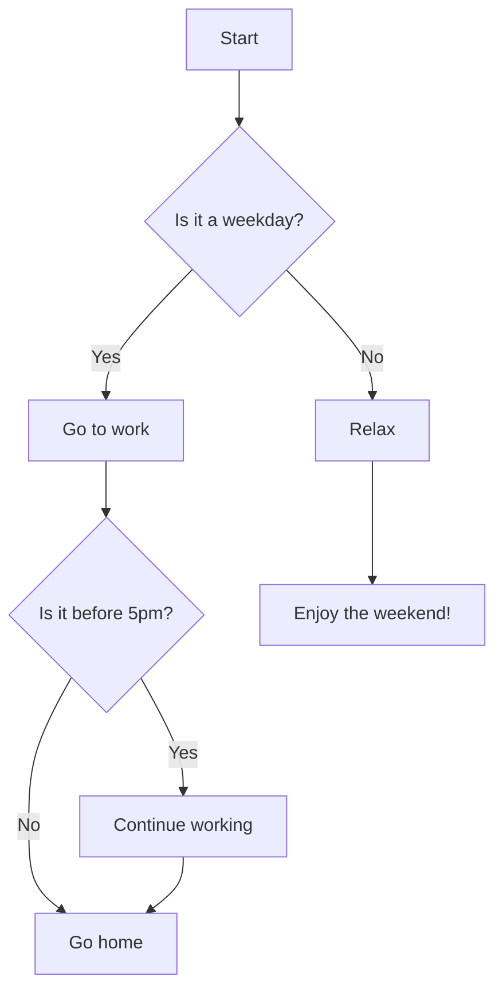

<a href="https://github.com/drshahizan/Generative-AI-Playground/stargazers"></a>
<a href="https://github.com/drshahizan/Generative-AI-Playground/network/members"></a>
<a href="https://github.com/drshahizan/Generative-AI-Playground/pulls"></a>
<a href="https://github.com/drshahizan/Generative-AI-Playground"></a>
<a href="https://github.com/drshahizan/Generative-AI-Playground/graphs/contributors"></a>


# Mermaid charts

Mermaid charts are a type of diagram and charting tool that allows you to generate visual representations of data and processes using a simple, text-based syntax. They are particularly useful for creating flowcharts, sequence diagrams, class diagrams, state diagrams, Gantt charts, and more. The Mermaid syntax is designed to be human-readable and easy to write, making it accessible for both technical and non-technical users.

Generative AI can be used to create prompts for Mermaid charts by automating the generation of the text-based descriptions that Mermaid requires to render diagrams. This can be particularly helpful in several ways:

1. **Efficiency**: Generative AI can quickly produce a variety of prompts based on user input, saving time and effort compared to manually writing the syntax.
2. **Complexity Management**: For more complex diagrams, AI can help organize and structure the information in a way that is optimal for Mermaid to interpret.
3. **Customization**: AI can tailor prompts to specific user requirements, ensuring that the resulting diagrams meet the exact needs of the project.
4. **Consistency**: When creating multiple diagrams, AI can help maintain a consistent style and level of detail across all charts.
5. **Innovation**: AI can suggest creative ways to represent data that might not be immediately obvious to human users, leading to more insightful visualizations.

Here's an example of how generative AI might create a prompt for a Mermaid flowchart:



In this example, the AI has generated a simple flowchart that outlines a typical decision-making process for a person's daily routine. The AI uses logical conditions and outcomes to create a diagram that is easy to understand and visually appealing.

By using generative AI, you can create a wide range of prompts for Mermaid charts that are customized to your data and processes, making it a powerful tool for visualization.

> **TIPS:** As there is a limit to the number of words that can be used in ChatGPT, you can input your text multiple times using the prompt "Read this [PARAPGRAPH]:" and then run your final prompt "Considering the above text...".

## BRAINSTORMING

```
Find a research topic for a PhD in the area of [TOPIC]
```


## Contribution 🛠️
Please create an [Issue](https://github.com/drshahizan/Generative-AI-Playground/issues) for any improvements, suggestions or errors in the content.

[](https://visitorbadge.io/status?path=https%3A%2F%2Fgithub.com%2Fdrshahizan)

