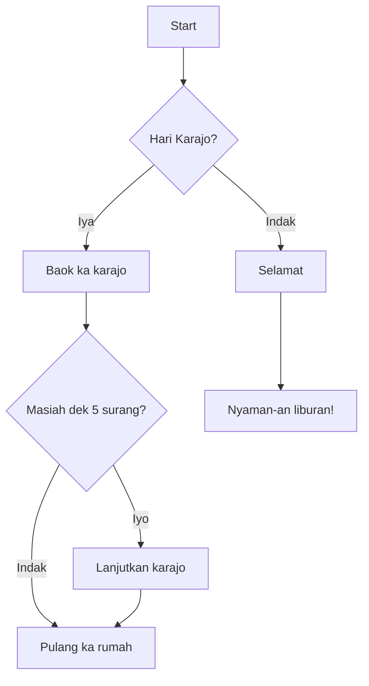

<a href="https://github.com/drshahizan/Generative-AI-Playground/stargazers"></a>
<a href="https://github.com/drshahizan/Generative-AI-Playground/network/members"></a>
<a href="https://github.com/drshahizan/Generative-AI-Playground/pulls"></a>
<a href="https://github.com/drshahizan/Generative-AI-Playground"></a>
<a href="https://github.com/drshahizan/Generative-AI-Playground/graphs/contributors"></a>


# Mermaid charts

Mermaid charts are a type of diagram and charting tool that allows you to generate visual representations of data and processes using a simple, text-based syntax. They are particularly useful for creating flowcharts, sequence diagrams, class diagrams, state diagrams, Gantt charts, and more. The Mermaid syntax is designed to be human-readable and easy to write, making it accessible for both technical and non-technical users.

Generative AI can be used to create prompts for Mermaid charts by automating the generation of the text-based descriptions that Mermaid requires to render diagrams. This can be particularly helpful in several ways:

1. **Efficiency**: Generative AI can quickly produce a variety of prompts based on user input, saving time and effort compared to manually writing the syntax.
2. **Complexity Management**: For more complex diagrams, AI can help organize and structure the information in a way that is optimal for Mermaid to interpret.
3. **Customization**: AI can tailor prompts to specific user requirements, ensuring that the resulting diagrams meet the exact needs of the project.
4. **Consistency**: When creating multiple diagrams, AI can help maintain a consistent style and level of detail across all charts.
5. **Innovation**: AI can suggest creative ways to represent data that might not be immediately obvious to human users, leading to more insightful visualizations.

Here's an example of how generative AI might create a prompt for a Mermaid flowchart:

Code:
```
graph TD;
    A[Start] --> B{Hari Karajo?};
    B -- Iya --> C[Baok ka karajo];
    B -- Indak --> D[Selamat];
    C --> E{Masiah dek 5 surang?};
    E -- Iyo --> F[Lanjutkan karajo];
    E -- Indak --> G[Pulang ka rumah];
    D --> H[Nyaman-an liburan!];
    F --> G;
```



In this example, the AI has generated a simple flowchart that outlines a typical decision-making process for a person's daily routine. The AI uses logical conditions and outcomes to create a diagram that is easy to understand and visually appealing.

By using generative AI, you can create a wide range of prompts for Mermaid charts that are customized to your data and processes, making it a powerful tool for visualization.

## PROMPTS

```
Illustrate the **flow of capital** in an international trade transaction using a flowchart.
```

```
2. "Map out the **customer journey** in a bank loan application process with a sequence diagram."
```

```
3. "Show the **relationship between different financial products** offered by a bank using a class diagram."
```

```
4. "Create a Gantt chart detailing the **timeline for a financial audit**."
```

```
5. "Design a state diagram that outlines the **various states of a mortgage application**."
```

```
6. "Visualize the **distribution of investments** in a mutual fund with a pie chart."
```

```
7. "Draft a mindmap that explores the concept of '**digital currencies**' and their impact on traditional banking."
```

```
8. "Develop a component diagram that represents the **architecture of online banking systems**."
```

```
9. "Compose a user journey map in Mermaid to visualize the steps a customer takes from **opening an account to investing**."
```

```
10. "Assemble a network diagram that displays the **IT infrastructure of a multinational bank**."
```

```
11. "Generate a flowchart that explains the **process of credit risk assessment**."
```

```
12. "Create a sequence diagram showing the **interaction between a customer and an ATM** during a withdrawal."
```

```
13. "Construct a class diagram for a **stock trading platform**, including entities like Trader, Stock, and TradeOrder."
```

```
14. "Formulate a Gantt chart for the **rollout of a new banking service**, including key phases and milestones."
```

```
15. "Sketch a state diagram for the **life cycle of a bank check** from issuance to clearance."
```

```
16. "Illustrate the **allocation of a bank's assets** across different sectors using a pie chart."
```

```
17. "Map out the **evolution of mobile banking** with a timeline diagram."
```

```
18. "Show the **interdependencies between various departments** in a bank using a component diagram."
```

```
19. "Visualize the **steps involved in international money transfer** with a flowchart."
```

```
20. "Draft a mindmap that categorizes the **types of loans** offered by financial institutions."
```

```
21. "Develop a sequence diagram that captures the **process of financial planning** with a client."
```

```
22. "Compose a class diagram that models the **entities in a peer-to-peer lending system**."
```

```
23. "Create a Gantt chart for the **implementation of a new banking regulation**."
```

```
24. "Design a state diagram that depicts the **approval process for a business loan**."
```

```
25. "Generate a network diagram that outlines the **communication channels within a financial market exchange**."
```

## Contribution 🛠️
Please create an [Issue](https://github.com/drshahizan/Generative-AI-Playground/issues) for any improvements, suggestions or errors in the content.

[](https://visitorbadge.io/status?path=https%3A%2F%2Fgithub.com%2Fdrshahizan)

